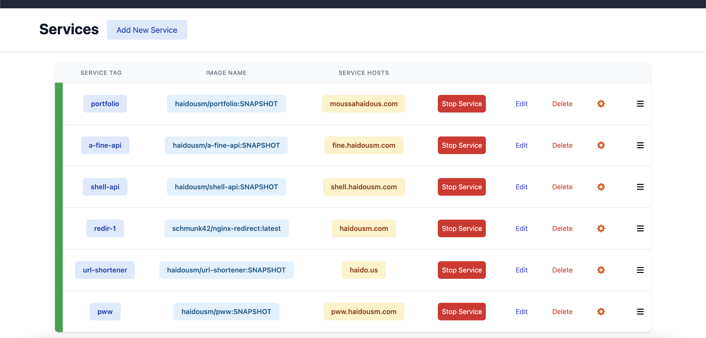

# Traefiker

Traefiker is a web dashboard for [Traefik](https://traefik.io/) that provides a simple, intuitive interface for managing & deploying your services.

## Prerequisites

-   [Traefik](https://traefik.io/)
-   [Docker](https://www.docker.com/)
-   [MongoDB](https://www.mongodb.com/)
-   [Docker Compose](https://docs.docker.com/compose/) (optional)

You'll need to have setup Traefik before you can begin using Traefiker.

There's lots of tutorials online or you can use the [Traefik documentation](https://doc.traefik.io/traefik/getting-started/quick-start/) to get started.

Additionally, you can use my [Traefik Starter Files](https://github.com/haidousm/traefik-starter).

## Usage

Traefiker is broken down into two applications:

    * Server
    * Client

Before deploying either, you'll need to configure your username-password for the dashboard.

-   Run `cd server/ && yarn gen-keys && yarn create-user <username> <password>` to generate the keys and create your admin user.

You're now ready to deploy Traefiker!

To get Traefiker up & running locally, modify the `./conf/dev.yml` to point to your MongoDB database.

Then, run `docker-compose -f docker-compose.yml -f ./conf/dev.yml up` to start the services and head over to the dashboard.

## Contributing

To contribute, please open an issue or pull request on [GitHub](https://github.com/haidousm/traefiker/issues).

## Possible TODOs:

-   [x] Add support for using Traefiker as the source of truth vs Docker
-   [ ] Add support for multiple projects (which contain multiple services)
-   [ ] Add support for deploying on different physical machines from a single dashboard (using Docker's SSH)
-   [ ] Add support for containerizing a GitHub repo (take in a repo name and clone it into a Docker image)
-   [ ] Create a CLI tool that parses a deployment file and deploys the services
